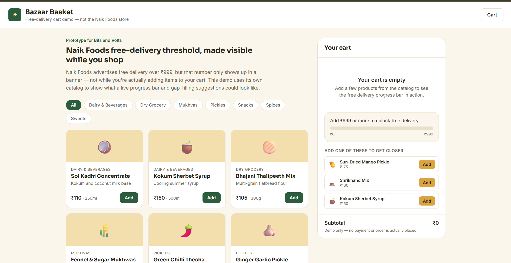
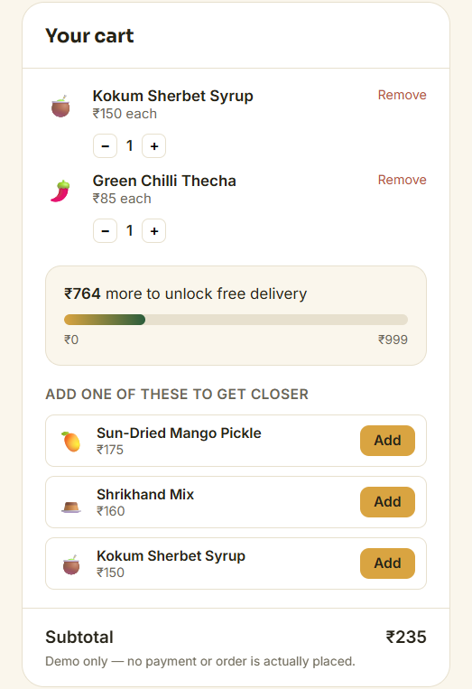
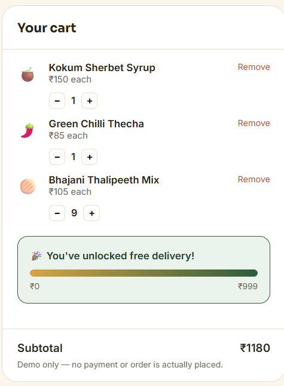

# Full Stack MERN Intern Task

**Submitted for:** Bits and Volts Private Limited

**Website studied:** Naik Foods - https://www.naikfoods.co.in/in

---

## 1. Introduction

For this task I studied the live Naik Foods website as both a shopper and as a developer, and picked one improvement to actually build as a working MERN prototype rather than just describe. This document covers what I found on the site, why I think it matters, and how the prototype addresses one of those findings.

I want to be upfront about method: everything in Section 5 comes from pages I actually opened and inspected on the live site. Where I couldn't fully verify something, such as account/reorder behavior that needs a login or blog post bodies I didn't open individually, I've said so instead of presenting it as confirmed fact.

## 2. Website Studied

Naik Foods is a Pune-based e-commerce store selling Maharashtrian regional food, including snacks, pickles, sweets, spices, dairy/beverages, and mukhvas. The site is built on Next.js, with product images served through Cloudinary and payments through Razorpay. The image URL naming pattern (`medusa/...`) suggests the commerce backend is Medusa.js, though I can't confirm that without access to their actual stack.

## 3. User Perspective Analysis

Shopping the site as a customer would:

- The homepage is visually clean and does a good job introducing the brand. Banners, featured categories, bestsellers, and a "10% off" offer are all above the fold.
- Getting from homepage to a specific product works fine if you're browsing by category. It gets slower once you already know what you want, because there's no search bar anywhere in the header.
- The product page for Beetroot Chips, the one I opened in detail, has a photo, price, weight, and 56 reviews shown, but the actual product description is mostly repeated marketing phrases such as "guilt-free snacking" and "on-the-go crunchy bite" rather than facts like ingredients or shelf life.
- The site repeatedly tells you free delivery kicks in above ₹999, but I never saw that number tracked anywhere while actually shopping, not on the product page, and I wasn't able to add an item to test the live cart view since that page renders client-side.
- The brand's actual story, an 80-year-old family business and grandmother's recipes, is genuinely interesting, but it's tucked away on the About page and doesn't show up while you're browsing products.

## 4. Developer Perspective Analysis

Looking at the site from a build/architecture angle:

- It's a modern Next.js site with image optimization already in place (`_next/image` with width/quality parameters), which is a solid technical foundation.
- Category and store pages are server-rendered with the product grid, but interactive pieces like the cart, filters sidebar, and sort dropdown are client-rendered, so I could see them exist but not fully test their behavior through a static fetch.
- Two products on the store listing page display ₹0 as their price. That's either a data entry issue in the catalog or a bug in how price is being read/displayed for those specific items. I can't tell which without backend access, but it's visibly wrong on the live site right now.
- One PDP I checked had a variant selector showing placeholder text ("Select Default option") instead of an actual label, which suggests either a missing product option name in the catalog or a fallback string that's supposed to be replaced and isn't.
- No structured product data such as ingredients, allergens, shelf life, or FSSAI number appeared on the product page I opened. This is a data/schema gap worth flagging for a food e-commerce site specifically.

## 5. Key Findings

### Finding 1 - No search across the catalog

**What I noticed:** The header only has Home / About / Shop / Blogs / Contact plus Account/Wishlist/Cart icons. No search bar or icon. The store page paginates 12 products at a time across 10 pages (115 products total).

**Why it matters:** A customer who already knows what they want has to browse by category and page through results instead of just typing the name.

**Recommended improvement:** Add a search bar with basic name/tag matching and autocomplete.

**Technical approach:** MongoDB text index on product name/tags, an Express search endpoint, and a debounced React input.

**Priority:** High

**Expected impact:** Better product discovery for intent-driven shoppers.

### Finding 2 - Two products show ₹0

**What I noticed:** "Aaswad Mitha Paan" and "Shahi Mukhwas" both display ₹0 on the store listing, while every other product has a real price.

**Why it matters:** This looks like a live pricing/data issue. At minimum it's confusing; at worst someone could try to check out a free item.

**Recommended improvement:** Audit the catalog for zero or missing prices.

**Technical approach:** This is a data-layer fix on their side. I flagged it rather than guessing at their admin tooling, since I don't have backend access.

**Priority:** High

**Expected impact:** Data integrity and prevention of possible checkout issues.

### Finding 3 - Product pages are missing ingredients, allergens, and shelf-life information

**What I noticed:** The Beetroot Chips PDP has five sections of marketing copy but no ingredients list, no allergen warning, no shelf life, and no FSSAI license number.

**Why it matters:** This is food. Someone with an allergy, or someone checking for preservatives or ingredients, has no clear way to check before ordering.

**Recommended improvement:** Add a structured "Ingredients & Nutrition" section on every product page.

**Technical approach:** Add a `nutrition` sub-document to the product schema containing ingredients, allergens, shelf life, and FSSAI number, then render it as a collapsible section.

**Priority:** High

**Expected impact:** Better trust, transparency, and fewer pre-purchase support questions. Applicable regulatory requirements should also be reviewed for the final implementation.

### Finding 4 - Placeholder text left in the variant selector

**What I noticed:** The Beetroot Chips PDP's option selector reads "Select Default option" / "Default option value" instead of a real label.

**Why it matters:** It reads as unfinished and could appear on other product pages that use the same variant pattern.

**Recommended improvement:** Replace default/placeholder labels with real option names at the catalog level.

**Priority:** Medium

**Expected impact:** Better perceived polish and fewer wrong-size or wrong-variant orders.

### Finding 5 - The ₹999 free-delivery threshold isn't visible while shopping

**What I noticed:** "Free Delivery - Minimum order ₹999" is shown in the trust strip on every page, but there's no live progress or running total shown on the product page, and I wasn't able to verify it inside the actual cart page since it renders client-side.

**Why it matters:** Most items are relatively low-priced, so it can take several items to hit ₹999. A shopper has no easy way to tell how close they are without doing the math themselves.

**Recommended improvement:** Show a progress indicator toward ₹999 in the cart, with specific low-cost item suggestions to close the gap.

**Technical approach:** Track subtotal in cart state, compare it to the threshold, and call a suggestions endpoint filtered by the remaining amount.

**Priority:** High

**Expected impact:** Potentially higher average order value by making an existing delivery incentive visible and actionable. This is a product hypothesis; no specific percentage improvement is claimed because the prototype has no real usage data.

### Finding 6 - The brand's heritage story never reaches the shopping pages

**What I noticed:** The About page has a strong, specific story about the family business since 1938 and recipes from "Aaji." None of that appears on product or category pages, which instead use more generic product copy.

**Why it matters:** For a brand selling authentic regional food, the founder story is a real differentiator that isn't being used where it could influence a purchase decision.

**Recommended improvement:** Pull a short, specific line from the brand story into relevant categories, especially pickles, since the homepage already references "Aaji's Recipe."

**Priority:** Medium

**Expected impact:** Better trust and differentiation, especially for customers unfamiliar with regional products.

### Finding 7 - Blog content isn't visibly linked to products

**What I noticed:** Blog post titles such as "10 Healthy & Crunchy Snack Products You Must Try" and "10 Delicious Upwas Snacks You Must Try During Fasting" are directly relevant to the catalog, but the blog listing page shows no product links or "shop this" CTAs.

**Why it matters:** These post titles look suitable for search traffic already. Not connecting useful content to the shop may be a missed conversion path.

**What needs verification:** I only opened the blog listing page, not individual post bodies, so I can't confirm whether the posts themselves link to products internally. This needs a manual check before treating it as a confirmed gap.

**Recommended improvement:** If not already present, add inline product links inside blog post content.

**Priority:** Medium

**Expected impact:** Better SEO-to-purchase conversion.

### Finding 8 - Reorder/"buy again" behavior is unverified

**What I noticed:** Account and Wishlist icons exist in the header, but checking one-click reorder requires being logged in with order history, which I couldn't do without an account.

**Why it matters:** For a snacks and pickles brand, repeat purchase can be an important revenue lever. If reordering takes more than one or two steps, that could represent a retention opportunity.

**What needs verification:** Whether this feature exists at all. I am flagging this as an opportunity to check, not a confirmed missing feature.

**Priority:** Medium, pending verification

**Expected impact:** Potentially better repeat purchase rate.

### Finding 9 - Product recommendations don't look personalized to what you're viewing

**What I noticed:** On the Beetroot Chips page, the "Featured Products" section below showed Corn Chakali and Thepla Puri. These are reasonable picks, but nothing on the interface suggested they were selected because they pair with Beetroot Chips rather than simply being generally featured products.

**Why it matters:** For a food store, "frequently bought together" or "pairs well with" suggestions are a natural way to raise order value.

**Recommended improvement:** Tag products with simple pairing relationships and surface those instead of, or alongside, generic featured items.

**Priority:** Low

**Expected impact:** Higher average order value and cross-category discovery.

### Finding 10 - Homepage testimonials should be tied to verifiable customer sources

**What I noticed:** Six testimonials with names and Instagram/Google handles appear on the homepage, with fairly similar-sounding copy across all six.

**Why it matters:** I am not claiming these are fake because I have no way to verify that. However, if they are not sourced from actual verified orders, that could become a trust risk as customers compare reviews.

**Recommended improvement:** If not already the case, source testimonials from verified orders and link to the original review where possible.

**Priority:** Low

**Expected impact:** Better trust and credibility.

## 6. Other Improvement Opportunities

A few additional thoughts, clearly separated by confidence:

- **Search (confirmed missing, Finding 1):** The single most concrete gap I found because it is a simple presence/absence check.
- **Product information quality (confirmed on the page I checked, Finding 3):** I would spot-check a few more product pages before assuming every product has the same gap.
- **Catalog data quality (confirmed, Finding 2):** The ₹0 pricing issue is directly observable.
- **Brand storytelling (confirmed contrast, Finding 6):** The About page content exists and is strong; the gap is the lack of reuse elsewhere.
- **Blog-to-product linking (needs verification, Finding 7):** Plausible based on the listing page, not confirmed at the individual-post level.
- **Repeat purchasing (needs verification, Finding 8):** Could not be checked without an account.
- **Product pairing/bundling (inference, Finding 9):** Based on what displayed, not on knowledge of the actual recommendation logic.

## 7. Selected Feature

I chose to build the **free delivery progress + smart suggestions** feature (Finding 5) over the other two candidates I considered: a search bar and a structured nutrition/ingredients section.

Search is the more expected pick for an e-commerce prototype, but it is also the most generic. The free-delivery nudge is tied to something specific Naik Foods is already doing, advertising a ₹999 threshold on every page, without following through on it anywhere in the actual shopping flow. Building this shows I read their site specifically rather than defaulting to "e-commerce site needs search."

It also exercises a useful spread of the MERN stack for a short assignment: real cart state on the frontend, a genuine database-backed query on the backend, and a UI feature that is small enough to implement cleanly.

## 8. Prototype

**Problem:** The ₹999 free-delivery threshold is advertised but not tracked while shopping.

**Solution:** A cart that shows a live progress bar toward ₹999, the exact amount remaining, and specific product suggestions priced to help close that gap, all backed by a real Express + MongoDB API rather than hardcoded values.

**User flow:**

1. Browse the demo catalog, filter by category, and add items to cart.
2. Open the cart, shown as a sidebar on desktop and a bottom drawer on mobile.
3. See the subtotal, progress bar, and "₹X more to unlock free delivery."
4. See 1-3 suggested products priced to help close that gap, pulled live from the suggestions API.
5. Add a suggestion directly from the cart.
6. Once the subtotal reaches ₹999, the progress bar fills and a success message replaces the "add more" prompt.

**Screens:** One main screen, a catalog view with a persistent cart panel, because the feature is centered around the cart rather than a multi-page flow.

**Expected benefit:** Making an existing delivery incentive visible and actionable can encourage customers to add useful items rather than abandoning or under-filling a basket. I am not claiming a specific percentage improvement because the prototype has no real customer usage data.

## 9. Technical Architecture

```text
┌──────────────────────────┐
│     React + Vite         │
│       Frontend           │
│                          │
│  Product Catalog         │
│  Cart & Suggestions      │
└────────────┬─────────────┘
             │
             │ REST API
             ▼
┌──────────────────────────┐
│     Node.js + Express    │
│       Backend API        │
│                          │
│  Products API            │
│  Suggestion Logic        │
└────────────┬─────────────┘
             │
             │ Mongoose
             ▼
┌──────────────────────────┐
│      MongoDB Atlas       │
│                          │
│    Demo Product Data     │
└──────────────────────────┘

Deployment:
React/Vite → Netlify
Express API → Render
Database → MongoDB Atlas

## 10. Database Design

Single collection: **products**

| Field | Type | Why it exists |
|---|---|---|
| `name` | String | Product display name |
| `category` | String | Used for filter chips and suggestion category diversity |
| `price` | Number | Core value for cart math and suggestion queries |
| `weight` | String | Display only, for example "100g" |
| `tagline` | String | Short description shown on the product card |
| `imageEmoji` | String | Stand-in for a product photo; no real Naik Foods or copyrighted imagery is used |
| `createdAt` / `updatedAt` | Date | Standard Mongoose timestamps |

One collection was enough here. The cart is not persisted server-side in this prototype; it lives in React state on the client, so there is no need for `carts` or `orders` collections for the feature being demonstrated.

## 11. API Documentation

### `GET /api/health`

Health check.

**Response:**

`{ "status": "ok" }`

### `GET /api/products`

Returns the full demo catalog, sorted by category then price.

**Response:**

`{ "products": [ { "_id", "name", "category", "price", "weight", "tagline", "imageEmoji" }, ... ] }`

### `GET /api/products/suggestions?remaining=<number>`

Returns up to 3 products worth suggesting to a customer who needs `remaining` more rupees to hit the free-delivery threshold.

The endpoint is rule-based, not ML. It ranks products by price closeness to the remaining amount within a small buffer and gives a light preference to category variety.

**Response:**

`{ "suggestions": [ {...product}, ... ] }`

**Errors:** `400` if `remaining` is missing, negative, or not a number.

## 12. Technologies Used

- React 18 + Vite
- Plain CSS with custom properties for theming
- React Context + `useReducer` for cart state
- Node.js + Express
- MongoDB + Mongoose
- `cors` and `dotenv`

## 13. Setup Instructions

See `README.md` for full details.

Short version:

```bash
cd server
npm install
cp .env.example .env

cd ../client
npm install
cp .env.example .env
```

Configure the required environment variables before running the application.

## 14. Running the Project

```bash
# Terminal 1 - backend
cd server
npm run seed
npm run dev

# Terminal 2 - frontend
cd client
npm run dev
```

Then open:

`http://localhost:5173`

## 15. Deployment

The prototype is deployed as a working full-stack application.

**Frontend:** Netlify

**Live Frontend:** https://rainbow-hamster-54a2fe.netlify.app/

**Backend:** Render

**Live Backend:** https://naik-foods-cart-api.onrender.com

**Database:** MongoDB Atlas

**GitHub Repository:** https://github.com/Chandrika-appari01/naik-foods-cart-prototype

The frontend communicates with the deployed Express backend through the API, and the backend connects to MongoDB Atlas. Environment variables are used for database and deployment configuration. No secrets are committed to the repository.

## 16. Screenshots

The following screenshots demonstrate the working prototype:

### 16.1 Product Catalog



This screenshot shows the demo product catalog and shopping interface.

### 16.2 Cart with Free Delivery Progress and Smart Suggestions



This screenshot shows the live ₹999 free-delivery progress, current cart subtotal, remaining amount, and smart product suggestions that help the user reach the free-delivery threshold.

### 16.3 Free Delivery Unlocked



This screenshot shows the success state after the cart reaches ₹999 and free delivery is unlocked.

The screenshots were captured from the deployed prototype during testing.

## 17. Future Improvements

- Persist the cart to `localStorage` so a page refresh does not clear it.
- Add a basic checkout summary screen to demonstrate the full flow end to end.
- Replace emoji placeholders with real, licensed product photography.
- Add automated tests for cart calculations and suggestion ranking.
- Make the ₹999 threshold configurable from a settings screen instead of only an environment variable.
- Add analytics to measure whether the progress indicator and suggestions actually improve conversion and average order value.
- Add product pairing rules or recommendation logic based on actual purchase data once enough data is available.

## 18. Conclusion

The biggest thing I took away from studying the site instead of guessing at generic e-commerce improvements is that Naik Foods already has good foundations: a real brand story, strong product presentation, and a modern frontend stack. However, there are a few specific and fixable gaps, including search discoverability, catalog data quality, product-information transparency, and an underused free-delivery incentive.

I picked the free-delivery gap to build because it was the most concrete example of a message the site already gives customers but does not make actionable during the shopping journey. The prototype turns that static incentive into a live cart experience with progress feedback and relevant gap-filling suggestions, while keeping the implementation realistic for the scope of the assignment.

